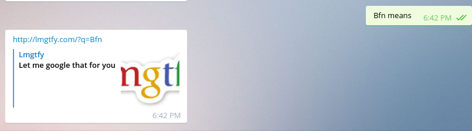

# Telegram-Bots
This repo is denoted to all the telegram bots that I am going to write.

#LMGTFY Bot

This is a simple telegram bot which is used to fetch LMGTFY url from [lmgtfy](lmgtfy.com) . You just need to text the bot in the following manner:

* bfn means
* /means bfn

I have tried to make sure it accepts all combination of means , mean and those words. It then gives you a link in the chat.

Telegram users can talk to this bot, add it to different groups. Handle of the bot is: @lmgtfgyou_bot .

For those who wants to write there own bot or host it on their machines, keep on reading.

#Dependencies

`pip install python-telegram-bot --upgrade`

#Use

First register your bot with Botfather on telegram and obtain HTTP API token. Once that is done replace the placeholder in this line with the token.

`bot = telegram.Bot('Put your token here')`

Now you are good to go, just start your script as :

`python lmgtfy_bot.py`

It should start working , for further refference and api docs you should look at their [repo.](http://python-telegram-bot.readthedocs.org/en/latest/py-modindex.html)
